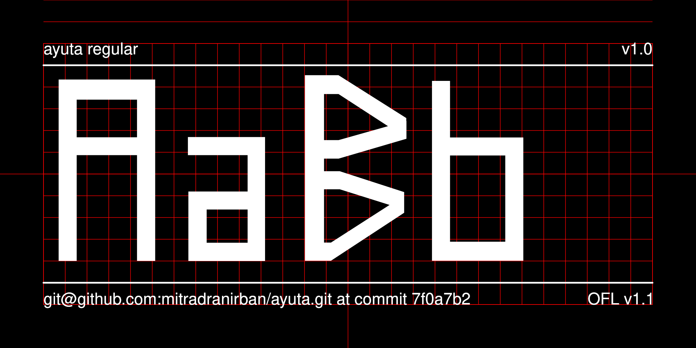
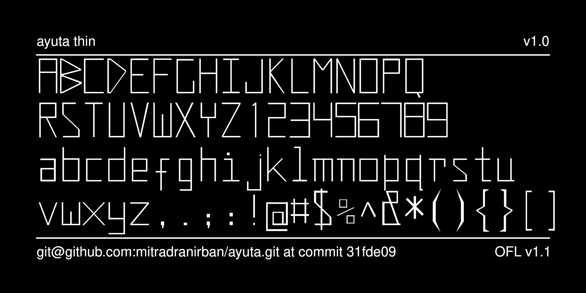

----

# AYUTA Variable Weight Hangeul Font

[![][Fontbakery]](https://mitradranirban.github.io/ayuta.git/fontbakery/fontbakery-report.html)
[![][Universal]](https://mitradranirban.github.io/ayuta.git/fontbakery/fontbakery-report.html)
[![][GF Profile]](https://mitradranirban.github.io/ayuta.git/fontbakery/fontbakery-report.html)
[![][Shaping]](https://mitradranirban.github.io/ayuta.git/fontbakery/fontbakery-report.html)

[Fontbakery]: https://img.shields.io/endpoint?url=https%3A%2F%2Fraw.githubusercontent.com%2Fmitradranirban%2Fsamaano-fonts%2Fgh-pages%2Fbadges%2Foverall.json
[Universal]: https://img.shields.io/endpoint?url=https%3A%2F%2Fraw.githubusercontent.com%2Fmitradranirban%2Fsamaano-fonts%2Fgh-pages%2Fbadges%2FUniversalProfileChecks.json
[Font File]: https://img.shields.io/endpoint?url=https%3A%2F%2Fraw.githubusercontent.com%2Fmitradranirban%2Fsamaano-fonts%2Fgh-pages%2Fbadges%2FFontFileChecks.json
[Repository]: https://img.shields.io/endpoint?url=https%3A%2F%2Fraw.githubusercontent.com%2Fmitradranirban%2Fsamaano-fonts%2Fgh-pages%2Fbadges%2FRepositoryChecks.json
[OpenType]: https://img.shields.io/endpoint?url=https%3A%2F%2Fraw.githubusercontent.com%2Fmitradranirban%2Fsamaano-fonts%2Fgh-pages%2Fbadges%2FOpenTypeSpecificationChecks.json

Ayuta is named after ancient Indian Kingdom of Ayuta, which some say is present day Ayodhya, or more likely, Ay kindom ofof ancient Tamilakam, what is modern day Tamilnadu in India. In 1st Century C.E., Princess of Ayuta Semvalam a.k.a Suriratna,sailed to Korean Peninsula in a big boat, married King Suro of Geumgwan Gaya, and became Empress Boju (보주태후). She carried with her Pandyan language and culture, so many Tamil words are now part of Korean Vocabulary.

This font is created by an Indian font designer, to commomorate 2000 yrs of cultural relation between India and Korea initiated by Princess of Ayuta.

A simplistic design is planned with Jamos created with mostly rectangular components.

## About
This font is created by Dr Anirban Mitra, an amateure Typographer and Free Software Enthusiast. 
 
## Building

Fonts are built automatically by GitHub Actions - take a look in the "Actions" tab for the latest build.

 

The proof files and QA tests are also available automatically via GitHub Actions - look at https://mitradranirban.github.io/ayuta.git.

## Changelog

The font is presently in alpha phage 

## License

This Font Software is licensed under the SIL Open Font License, Version 1.1.
This license is available with a FAQ at
https://scripts.sil.org/OFL

## Repository Layout

This font repository structure is inspired by [Unified Font Repository v0.3](https://github.com/unified-font-repository/Unified-Font-Repository), modified for the Google Fonts workflow.
